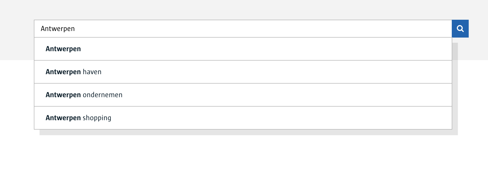

# Search Smart Widget UI (Angular)

## Deprecated

This widget has been deprecated and should not be used for new projects, although the code can be used as inspiration.

## Introduction

This is the Angular 6+ UI for a Smart Widget implementing a search bar with suggestions. It is matched by a [corresponding back-end service](https://bitbucket.antwerpen.be/projects/ASA/repos/search_api_nodejs/browse) which is needed when running it in remote mode.



There is a demo app, see below for instructions on running it.

## How to use

### Installing

```sh
> npm install @acpaas-ui-widgets/ngx-search
```

### Using

A BFF service should be running (see demo app instructions below for how to start one).

Import the component in your module:

```ts
@NgModule({
  imports: [
    ...,
    SearchWidgetModule
  ],
  ...
})
```

In the index.html, include the core branding stylesheet:

```html
<link rel="stylesheet" href="https://cdn.antwerpen.be/core_branding_scss/3.0.3/main.min.css">
```

> For projects that are still using Angular 5, we are [maintaining a v1 branch](https://github.com/digipolisantwerp/search_widget_angular/tree/v1), which will still receive bug fixes if needed.

```sh
> npm install @acpaas-ui-widgets/ngx-search@"<2.0.0"
```

### In your template:


```html
<aui-search url="http://localhost:4200/suggestions.json"></aui-search>
```

(Replace the url of the BFF service.)

### Supported attributes

- **method**: POST or a GET method to get suggestions (default: GET)
- **language**: Language of the query suggestions
- **url**: (Api) Url to provide suggestions for a search
- **placeholder**: Specify the text to show in an empty field (default: empty)
- **searchValue**: The results comes in an array with type SearchWidgetValue
- **suggestions**: The full results array of the remote suggestions (default: string[])
- **searchIncentiveText**: The message shown when the user focuses on the input field
- **minCharacters**: Minimal characters to search in the results (default: 2)
- **noResultsText**: Text when the results are empty
- **loadingText**: Text when loading the results
- **label**: If SearchWidgetValue is an object add label to show
- **query**: This is the value of the searchwidget
- **limit**: Give a limit for suggestions per page
- **iconLeft**: Change the location of searchbox (default: false)

### Events

- **search**:  The event fired when the search is triggered

The backing service implements the following protocol:

- POST /path/to/endpoint with raw body object:
- **query**: the value of search
- **language**: the language of the search

Example: 
```json
  {
    "query":"Aank",
    "language":"NL" 
  }
```
- suggestions = JSON-encoded array of [SearchWidgetValue](src/search-widget/search-widget.types.ts) objects

CSS examples:

```css
/* Changing the color of the searchbox: */
.aui-search .aui-search-icon{
    background-color: $green;
} 
```

## Run the demo app

```sh
> npm install
> npm start
```

Browse to [localhost:4200](http://localhost:4200)

To use the example app, you will need to have also started the [corresponding back-end service](https://bitbucket.antwerpen.be/projects/ASA/repos/search_api_nodejs/browse).

## Contributing

We welcome your bug reports and pull requests.

Please see our [contribution guide](CONTRIBUTING.md).

## License

This project is published under the [MIT license](LICENSE.md).
